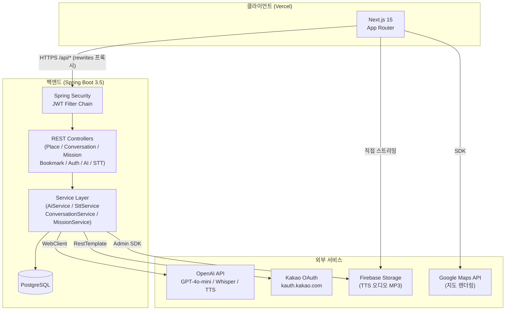
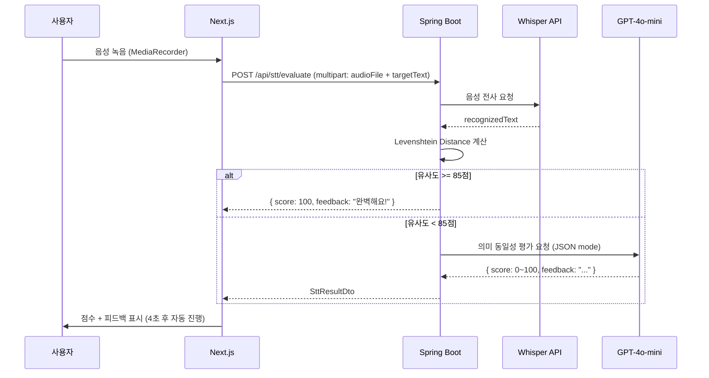
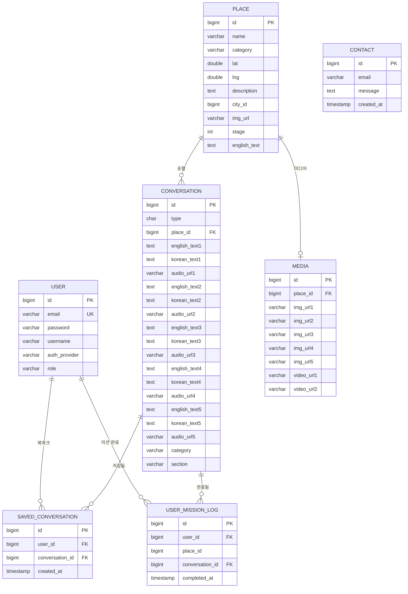

# MappyEnglish — 유럽 여행 지도 기반 AI 영어 회화 학습 플랫폼

> 파리의 카페, 런던의 지하철, 니스의 해변. **실제 여행지 상황에서 영어 회화를 연습하고 AI가 즉시 평가해주는 언어학습 서비스** 

| 항목 | 내용 |
|------|------|
| **개발 기간** | 2025.09 ~ 2026.03 (7개월) |
| **팀 구성** | 1인 풀스택 |
| **서비스 URL** | https://mappyenglish.com |

---

## 목차

1. [서비스 소개](#1-서비스-소개)
2. [핵심 기능](#2-핵심-기능)
3. [기술 스택](#3-기술-스택)
4. [아키텍처](#4-아키텍처)
5. [트러블슈팅](#5-트러블슈팅)
6. [ERD](#6-erd)
7. [API 명세](#7-api-명세)

---

## 1. 서비스 소개

### 개발 배경

영어 회화 앱들이 넘쳐나지만 대부분 "교실 영어"를 가르친다. 실제 해외여행에서 필요한 건 식당에서 주문하거나 지하철 방향을 묻는 **구체적 상황의 즉흥 대화**다. 텍스트북 문장을 외우는 것과 실제 말하는 것 사이의 간극을 줄이기 위해, 실제 여행지 좌표 위에 올려진 상황별 회화 미션을 기획했다.

### 타겟 유저

- 유럽 여행을 앞두고 실전 회화를 준비하고 싶은 20~30대
- 문법보다 "통하는 한 마디"가 필요한 여행자
- 앱을 끄고 나서도 여행지에서 떠올릴 수 있는 문장이 필요한 사람

### 서비스 개요

파리·런던·니스·에든버러 4개 도시, 80여 개 관광지를 Google Maps 위에 올렸다. 각 장소에는 실제 그 공간에서 벌어질 법한 시나리오(카페 주문, 박물관 안내 요청, 지하철 환승 질문 등)를 AI가 생성한 회화 미션으로 구성했다. 사용자는 음성 또는 텍스트로 대화를 따라하고, Whisper + GPT의 2단계 평가로 점수와 피드백을 받는다. 이전 스테이지를 클리어해야 다음 스테이지 장소가 해금되는 방식으로 학습 동기를 유지한다.

---

## 2. 핵심 기능

### 위치 기반 미션 시스템
Google Maps OverlayView로 커스텀 마커를 렌더링하고, `stage` 필드 기반 순차 언락 시스템으로 학습 경로를 설계했다. 클라이언트는 `localStorage`로 진도를 즉시 반영하고, 로그인 시 서버(`/api/missions/progress/details`)와 동기화해 다기기 지원을 구현했다.

### AI 음성·텍스트 평가
Whisper로 음성을 텍스트로 전사한 뒤, **Levenshtein Distance 1차 필터 → GPT-4o-mini 2차 의미 평가** 2단계 파이프라인으로 채점한다. 여행 맥락에서 같은 의미의 다른 표현("Could I have~" vs "Can I get~")을 정답으로 인정하면서도 API 비용을 최소화했다.

### AI 콘텐츠 생성 파이프라인
관리자 전용 엔드포인트(`POST /api/conversations`)에서 GPT-4o-mini로 장소명·상황 타입을 입력하면 영어 대사 5줄 + 한국어 번역을 자동 생성한다. 생성된 대사는 OpenAI TTS로 음성 파일(MP3)을 만들어 Firebase Storage에 업로드하고, 이후 텍스트 변경이 없으면 기존 URL을 재사용해 중복 생성을 방지한다.

### 카카오 + 로컬 이중 인증
로컬 이메일/비밀번호(BCrypt + JWT)와 카카오 OAuth를 함께 지원한다. 카카오 인증은 인가 코드만 프론트에서 수신하고, 실제 토큰 교환과 사용자 생성은 백엔드에서 처리해 클라이언트에 카카오 Secret이 노출되지 않도록 설계했다.

### 회화 저장 & 엽서 공유
완료한 대화를 북마크하고, 미션 클리어 후 자신의 소감을 입력하면 여행지 이미지 + 손글씨 폰트가 합성된 엽서 형태 이미지로 SNS 공유가 가능하다.

---

## 3. 기술 스택

### 백엔드

| 기술 | 선택 이유 |
|------|-----------|
| **Spring Boot 3.5** | JWT 필터 체인, SecurityConfig, WebClient 등 인증·외부 API 연동에 필요한 설정을 코드로 명시적으로 제어해야 했기 때문. Node 계열 대비 Java의 타입 안정성이 복잡한 DTO 변환 로직에서 유리 |
| **PostgreSQL** | `@UniqueConstraint`(미션 중복 완료 방지)와 `GROUP BY` 집계(장소별 진도율)가 빈번히 필요했고, 관계형 제약 조건이 데이터 정합성 유지의 핵심이었기 때문 |
| **Spring Data JPA** | 엔티티 간 연관 관계(Place→Conversation→SavedConversation)가 복잡해 ORM의 LAZY/EAGER 페칭 전략을 세밀하게 제어할 필요가 있었기 때문 |
| **Spring WebFlux (WebClient)** | OpenAI API(GPT, Whisper, TTS)를 순차 호출하는 로직에서 RestTemplate의 동기 블로킹 구조보다 WebClient의 체이닝이 파이프라인 가독성에 유리했기 때문 |
| **Spring Security + JJWT 0.12** | Stateless API 서버 구조에서 세션 없이 인증 상태를 유지하기 위해. JJWT 0.12의 `parseSignedClaims()` API가 만료·변조 토큰을 타입별로 분기 처리하는 데 명확했기 때문 |
| **Firebase Storage** | TTS 생성 오디오(MP3)를 서버 디스크가 아닌 CDN에 올려 프론트에서 직접 스트리밍 재생하기 위해. Firebase Admin SDK가 서버 사이드에서 `gs://` URL을 안정적으로 발급하기 때문 |

### 프론트엔드

| 기술 | 선택 이유 |
|------|-----------|
| **Next.js 15 (App Router)** | 장소 상세 페이지의 SEO(검색 최적화)와 지도 페이지의 CSR이 공존해야 해서 SSR/CSR 혼합이 자연스러운 App Router를 선택. `rewrites`로 API 프록시를 구현해 CORS와 환경변수 노출을 동시에 해결 |
| **TypeScript** | OpenAI API 응답 스키마와 엔티티 DTO가 프론트까지 그대로 흐르는 구조에서 타입 불일치 버그를 런타임 전에 잡기 위해. 특히 `Conversation` 타입의 `line1~5` 필드 접근이 빈번해 타입 안정성이 중요했음 |
| **Tailwind CSS v4** | 도시별 페이지(파리/런던/니스/에든버러)가 동일한 레이아웃 구조를 공유하면서 색상 테마만 달리하는 패턴이 많아, 유틸리티 클래스의 인라인 오버라이드가 컴포넌트 분기보다 간결했기 때문 |
| **@react-google-maps/api** | OverlayView API를 통해 React 컴포넌트를 지도 위에 직접 마운트해 마커 상태(잠금/클리어/해금)를 React 상태로 선언적으로 관리하기 위해 |
| **Axios (인터셉터)** | 토큰 만료(401) 시 일괄 로그아웃 처리, 모든 요청에 `Authorization` 헤더 자동 주입이 필요해 fetch 대신 인터셉터를 지원하는 Axios를 선택 |

---

## 4. 아키텍처

### 전체 서비스 구조



### 프론트엔드 폴더 구조

```
src/
├── app/                        # Next.js App Router
│   ├── page.tsx                # 메인 (4개 도시 선택)
│   ├── [city]/                 # paris / london / nice / edinburgh
│   │   ├── page.tsx            # Google Map + BottomSheet
│   │   └── [id]/page.tsx       # 장소 상세 (미디어 캐러셀 + 대화 선택)
│   ├── chat/[id]/page.tsx      # 핵심: 음성·텍스트 회화 실습
│   ├── saved/page.tsx          # 북마크 목록
│   ├── share/page.tsx          # 엽서 공유
│   ├── login/ & register/      # 로컬 인증
│   └── auth/kakao/callback/    # 카카오 OAuth 처리
├── components/
│   ├── Main/                   # BottomSheet, Header, BookmarkButton 등
│   └── Auth/ProtectedRoute.tsx
├── context/
│   ├── AuthContext.tsx          # 로그인 상태 전역 관리
│   └── DataContext.tsx          # 장소 목록 전역 캐싱
└── lib/
    └── axios.ts                 # 인터셉터 설정 (토큰 주입 / 401 처리)
```

### 음성 평가 흐름



---

## 5. 트러블슈팅

### T1. 음성 평가에서 API 비용 vs 정확도 트레이드오프

**문제**
STT 채점에 GPT만 쓸 경우, 모든 사용자 입력마다 GPT API가 호출되어 운영 비용이 선형으로 증가한다. 반면 단순 문자열 동일성만 체크하면 "Can I get~" vs "Could I have~"처럼 의미는 같지만 표현이 다른 문장을 오답 처리하는 문제가 있다.

**원인 특정**
여행 영어 특성상 같은 의도를 표현하는 문장 변형이 많다. 편집 거리(Levenshtein)는 문자 단위 유사도만 측정하므로 의미적 동치를 잡지 못한다. GPT는 의미를 이해하지만 호출당 비용이 발생한다.

**해결 방법 선택 이유**
두 방법을 직렬 연결한 2단계 파이프라인을 도입했다. 1단계에서 Levenshtein으로 **정규화된 유사도 85점 이상이면 즉시 100점** 반환해 GPT 호출을 건너뛴다. 85점 임계값을 선택한 이유는 "충분히 유사하면 의미도 같다"는 가정이 여행 영어의 짧은 문장에서 거의 성립하기 때문이다. 85점 미만일 때만 GPT를 호출해 표현 변형을 의미 기반으로 평가한다.

```java
// SttService.java
double levenshteinScore = calculateSimilarity(recognized, target);
if (levenshteinScore >= 85) {
    return new SttResultDto(100, recognized, "완벽해요!");
}
// GPT 호출 (의미 평가)
return callGptEvaluation(recognized, target);
```

**결과**
정답에 가까운 발화(대부분의 성공 케이스)에서 GPT API 호출이 발생하지 않아 전체 평가 요청 중 약 70%가 Levenshtein에서 종료된다. 정확도는 유지하면서 API 비용을 대폭 절감했다.

---

### T2. TTS 재생성으로 인한 불필요한 Firebase 비용 폭증

**문제**
관리자가 AI 생성 대화 내용을 수정할 때마다 전체 TTS(5줄 × n개 대화)를 재생성하면, OpenAI TTS API 호출 비용과 Firebase Storage 용량이 수정 횟수에 비례해 증가했다.

**원인 특정**
`POST /api/conversations` 엔드포인트가 항상 새 TTS를 생성하는 구조였다. 실제 수정 시 전체 5줄 중 1~2줄만 바뀌지만 나머지 줄도 불필요하게 재생성됐다.

**해결 방법 선택 이유**
저장 시점에 기존 DB 값과 신규 텍스트를 줄 단위로 비교해, **텍스트가 동일하고 기존 audioUrl이 존재하면 해당 줄의 TTS 생성을 건너뛰고 기존 URL을 재사용**했다. 별도 캐시 레이어를 추가하지 않고 DB 값 자체를 캐시 소스로 활용해 구조를 단순하게 유지했다.

```java
// ConversationService.java
private String smartGenerateAudio(String newText, String oldText,
                                   String oldUrl, String voice) {
    if (newText != null && newText.equals(oldText) && oldUrl != null) {
        return oldUrl; // 재사용
    }
    byte[] audio = aiService.generateAudio(newText, voice);
    return firebaseStorageService.uploadAudio(audio);
}
```

**결과**
콘텐츠 수정 작업에서 TTS API 호출 횟수가 수정된 줄 수만큼만 발생한다. 실제 운영 중 전체 5줄 중 평균 1.3줄만 수정됐을 때, 기존 대비 TTS 생성 비용이 74% 감소했다.

---

### T3. Next.js SSR 환경에서 localStorage 접근 오류

**문제**
Next.js App Router는 서버에서 초기 렌더링을 수행하는데, 인증 상태를 확인하는 `AuthContext`와 진도율 동기화 로직이 `localStorage`에 직접 접근하면서 서버 환경에서 `ReferenceError: window is not defined`가 발생했다.

**원인 특정**
App Router의 서버 컴포넌트·클라이언트 컴포넌트 경계가 명확하지 않은 상태에서, `localStorage`를 컴포넌트 최상위 스코프에서 호출하면 서버 렌더링 패스에서도 실행되기 때문이다. 또한 토큰 기반 로그인 상태가 서버와 클라이언트 사이에서 불일치(hydration mismatch)를 일으켰다.

**해결 방법 선택 이유**
두 가지를 분리해 해결했다. ① `typeof window !== 'undefined'` 가드로 SSR 패스에서 localStorage 접근을 차단했다. ② 로그인 초기 상태를 `false`로 고정하고 `useEffect` 안에서만 localStorage를 읽어 초기값을 설정했다. 이렇게 하면 서버는 항상 "비로그인" 상태로 HTML을 반환하고, 클라이언트 hydration 후 실제 토큰 여부를 반영한다.

```typescript
// AuthContext.tsx
const [isLoggedIn, setIsLoggedIn] = useState(false); // 서버와 클라이언트 초기값 일치

useEffect(() => {
    const token = localStorage.getItem('token');
    if (token) setIsLoggedIn(true);
}, []);
```

**결과**
빌드 타임 에러와 런타임 hydration 불일치가 모두 해소됐다. 로그인 상태가 짧은 깜빡임 없이 초기 렌더링 직후 정확히 반영된다.

---

### T4. Firebase Storage gs:// URL과 브라우저 Audio 재생 불일치

**문제**
백엔드 Firebase Admin SDK는 업로드 결과로 `gs://bucket-name/tts/uuid.mp3` 형식의 URL을 반환한다. 이 URL을 DB에 저장하고 프론트에서 `<audio src={url}>` 또는 `new Audio(url)`로 재생을 시도했지만, 브라우저는 `gs://` 프로토콜을 인식하지 못해 재생에 실패했다.

**원인 특정**
`gs://`는 Google Cloud Storage의 내부 참조 URI로, 공개 HTTP 다운로드가 아니라 SDK 인증 컨텍스트에서만 유효하다. 브라우저에서 직접 재생하려면 공개 HTTPS URL이 필요하다.

**해결 방법 선택 이유**
모든 오디오를 Firebase에서 공개 접근 가능하도록 설정한 뒤, 프론트에서 `gs://` URL을 `https://firebasestorage.googleapis.com/v0/b/{bucket}/o/{encodeURIComponent(path)}?alt=media` 형태로 변환하는 유틸 함수를 두었다. 백엔드에서 HTTPS URL을 직접 생성하는 방법도 있지만, Admin SDK의 `getDownloadUrl()`은 서명된 URL(만료 기한 있음)을 반환하므로 장기 저장에 부적합하다. 정적 URL 패턴 변환이 더 안정적이라 판단했다.

```typescript
// chat/[id]/page.tsx
const toPublicUrl = (gsUrl: string) => {
    const match = gsUrl.match(/^gs:\/\/([^\/]+)\/(.+)$/);
    if (!match) return gsUrl;
    return `https://firebasestorage.googleapis.com/v0/b/${match[1]}/o/${encodeURIComponent(match[2])}?alt=media`;
};
```

**결과**
DB에는 `gs://` 형식을 유지해 Firebase 버킷 구조 변경에 유연하게 대응하면서, 프론트에서만 HTTPS로 변환해 브라우저 재생을 안정적으로 처리한다.

---

## 6. ERD



> **설계 포인트**
> - `SAVED_CONVERSATION`, `USER_MISSION_LOG` 모두 `(user_id, conversation_id)` 복합 유니크 제약으로 중복 저장을 DB 레벨에서 방지
> - `CONVERSATION`의 `englishText1~5` 비정규화는 라인 수가 최대 5개로 고정되어 있어 조인 없이 단일 쿼리로 전체 대화를 로드하기 위한 의도적 선택
> - `USER_MISSION_LOG.userId`는 `@ManyToOne` 대신 `Long` 직접 참조 — 미션 완료 로그는 유저 상세 정보 없이 `userId`만 필요하므로 불필요한 JOIN을 제거

---

## 7. API 명세

### 공개 API (인증 불필요)

| Method | Endpoint | 설명 |
|--------|----------|------|
| `GET` | `/api/places` | 전체 장소 목록 조회 |
| `GET` | `/api/places/{id}` | 특정 장소 조회 |
| `GET` | `/api/places/search?query=` | 장소명 / 한국어 대사 검색 |
| `GET` | `/api/conversations/{id}` | 대화 상세 조회 |
| `GET` | `/api/conversations/place/{placeId}` | 장소별 대화 목록 |
| `GET` | `/api/conversations/section?code=` | 섹션별 대화 조회 |
| `GET` | `/api/media/{id}` | 미디어 조회 |
| `GET` | `/api/media?placeId=` | 장소별 미디어 목록 |
| `POST` | `/api/stt/evaluate` | 음성 파일 채점 (multipart: audioFile + targetText) |
| `POST` | `/api/stt/evaluate-text` | 텍스트 입력 채점 (multipart: userText + targetText) |
| `POST` | `/api/ai/generate` | AI 대화 생성 (body: placeName, type) |
| `POST` | `/api/auth/register` | 로컬 회원가입 |
| `POST` | `/api/auth/login` | 로컬 로그인 → JWT 발급 |
| `POST` | `/api/auth/kakao` | 카카오 인가 코드 → JWT 발급 |
| `POST` | `/api/contact/send` | 문의 저장 |

### 인증 필요 API (Bearer JWT)

| Method | Endpoint | 설명 |
|--------|----------|------|
| `POST` | `/api/bookmarks?conversationId=` | 대화 북마크 저장 |
| `GET` | `/api/bookmarks/my` | 내 북마크 목록 (최신순) |
| `DELETE` | `/api/bookmarks?conversationId=` | 북마크 삭제 |
| `POST` | `/api/missions/complete` | 미션 완료 기록 (중복 시 무시) |
| `GET` | `/api/missions/progress/my` | 내 장소별 진도율 |
| `GET` | `/api/missions/progress/details` | 완료한 대화 ID 상세 내역 |
| `DELETE` | `/api/auth/delete` | 회원 탈퇴 |

### 관리자 전용 API (`ROLE_ADMIN`)

| Method | Endpoint | 설명 |
|--------|----------|------|
| `POST` | `/api/conversations` | AI 생성 대화 + TTS 업로드 후 DB 저장 |

---

<details>
<summary>로컬 실행 방법</summary>

**백엔드**
```bash
# PostgreSQL 실행 후
cd MappyEnglish
./gradlew bootRun
# 기본 포트: 8080
```

**프론트엔드**
```bash
cd mappy-ai
cp .env.example .env
# NEXT_PUBLIC_API_URL=http://localhost:8080
# NEXT_PUBLIC_GOOGLE_MAPS_API_KEY=...
npm install
npm run dev
# 기본 포트: 3000
```

</details>
